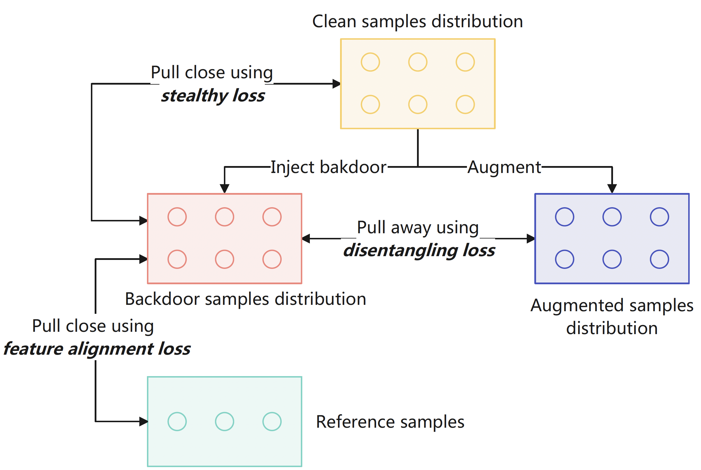

# IMPERATIVE - Towards Imperceptible Backdoor Attack in Self-supervised Learning
This repository contains the code of the paper "[Towards Imperceptible Backdoor Attack in Self-supervised Learning](https://arxiv.org/abs/2405.14672)", an imperceptible and effective backdoor attack against self-supervised models. 
<!-- Here is an overview of our IMPERATIVE:


<div align="center">

</div> -->


## Required python packages

Our code is tested under the following environment: NVIDIA GeForce RTX 3090, Ubuntu 22.04, cuda 11.8, Python 3.8.5, torch 2.0.1, torchvision 0.15.2, numpy 1.23.4, pandas 2.0.3, pillow 10.1.0, and tqdm 4.65.0.

## Pretraining image encoders

The file pretraining_encoder.py is used to pre-train an image encoder.

To pre-train an image encoder on CIFAR10 or STL10, you could first download the data from the following link [data](https://drive.google.com/drive/folders/1acJr1fP2paK6pNq2bL6lzPTccv6nSzX6?usp=sharing) (put the data folder under IMPERATIVE). Then, you could run the following script to pre-train image encoders on CIFAR10 and STL10:

```
python3 scripts/run_pretraining_encoder.py
```
It may take up more than 10 hours and 15G to pretrain the encoder on a NVIDIA GeForce RTX 3090. You can also download pre-trained image encoders on CIFAR10 or STL10 from the following link [data](https://drive.google.com/drive/folders/1acJr1fP2paK6pNq2bL6lzPTccv6nSzX6?usp=sharing) and put them under output folder.
## Pretraining backdoor injectors

The file optimize_filter/run_pretrain.sh is a script used to pre-train a backdoor encoder.

You could run the following script in the optimize_filter directory to pre-train a backdoor encoder on CIFAR10 and STL10:

```
python3 scripts/run_pretrain.sh
```
It may take up more than 5 hours and 10G to pretrain the backdoor injectors on a NVIDIA GeForce RTX 3090.
## IMPERATIVE

The file imperative.py implements our IMPERATIVE.

You can use the following example script to optimize a imperative backdoor trigger and embed it to an image encoder, where the shadow dataset is CIFAR10 and the reference inputs are images of a truck, digit one, and priority traffic sign:

```
python3 scripts/run_imperative.py
```
It may take up more than 10 hours and 10G to pretrain the backdoor injectors on a NVIDIA GeForce RTX 3090.
## Training downstream classifiers

The file training\_downstream\_classifier.py can be used to train a downstream classifier on a downstream task using an image encoder. Here are some example scripts:

```
python3 scripts/run_cifar10_training_downstream_classifier.py
python3 scripts/run_imagenet_training_downstream_classifier.py
```

It may take up more than 1 hours and 1G to pretrain the backdoor injectors on a NVIDIA GeForce RTX 3090.

## Experimental results


This table shows the experimental results when the pre-training dataset is CIFAR10 and STL10.

| Pre-training Dataset | Downstream Dataset | CA    | WaNet BA↑ | WaNet ASR↑ | CTRL BA↑ | CTRL ASR↑ | Ins-kelvin BA↑ | Ins-kelvin ASR↑ | Ins-xpro2 BA↑ | Ins-xpro2 ASR↑ | Ours BA↑ | Ours ASR↑ |
| -------------------- | ------------------ | ----- | --------- | ---------- | -------- | --------- | -------------- | --------------- | ------------- | -------------- | -------- | --------- |
| STL10                | CIFAR10            | 86.77 | 84.43     | 10.28      | 87.19    | 8.72      | 86.75          | 18.63           | 86.85         | 16.83          | 87.11    | **99.58** |
| STL10                    | GTSRB              | 76.12 | 74.45     | 5.23       | 77.57    | 8.17      | 76.49          | 72.95           | 76.71         | 14.02          | 75.82    | **97.97** |
| STL10                     | SVHN               | 55.35 | 58.29     | 16.83      | 54.29    | 3.32      | 56.67          | 38.03           | 58.42         | 18.68          | 58.62    | **99.76** |
| CIFAR10              | STL10              | 76.14 | 72.73     | 9.78       | 75.73    | 16.85     | 74.89          | 1.16            | 74.11         | 5.91           | 74.48    | **95.00** |
| CIFAR10                     | GTSRB              | 81.84 | 75.85     | 5.46       | 79.94    | 97.95     | 78.56          | 2.50            | 75.08         | 42.40          | 79.15    | **98.73** |
| CIFAR10                     | SVHN               | 61.52 | 54.79     | 17.99      | 66.33    | 40.91     | 68.49          | 22.13           | 68.95         | 30.91          | 63.67    | **98.79** |


This table shows the results when applying IMPERATIVE to [image encoder pre-trained on ImageNet](https://github.com/google-research/simclr):

| Downstream Dataset | CA    | ISSBA BA↑ | ISSBA ASR↑ | Ours BA↑ | Ours ASR↑ |
| ------------------ | ----- | --------- | ---------- | -------- | --------- |
| STL10              | 95.68 | 92.58     | 9.97       | 93.48    | 100.00    |
| GTSRB              | 80.32 | 66.29     | 5.10       | 82.84    | 96.00     |
| SVHN               | 74.77 | 67.67     | 18.03      | 75.40    | 99.99     |

We refer to the following code in our implementation:
https://github.com/google-research/simclr,
https://github.com/jinyuan-jia/BadEncoder,
https://github.com/leftthomas/SimCLR


